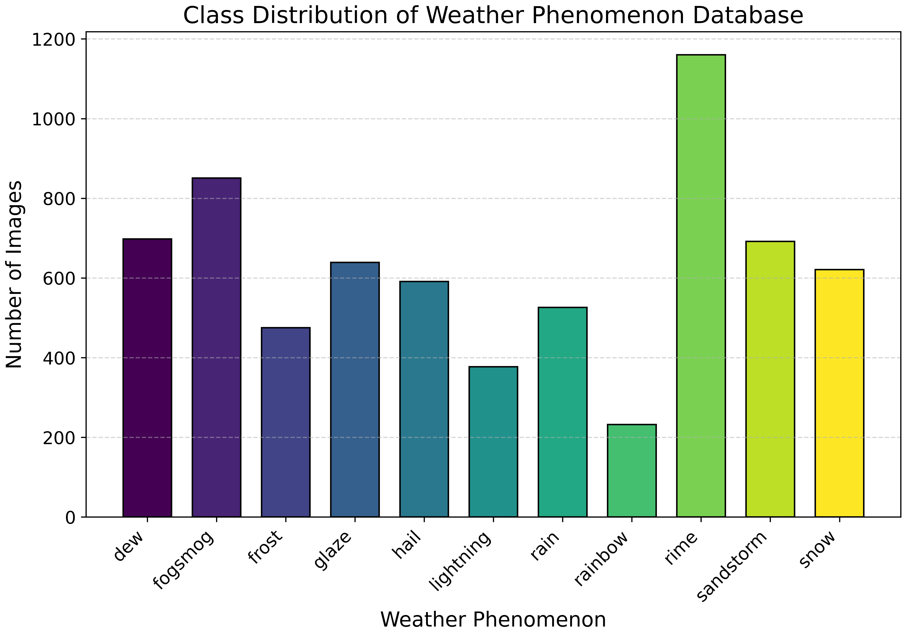
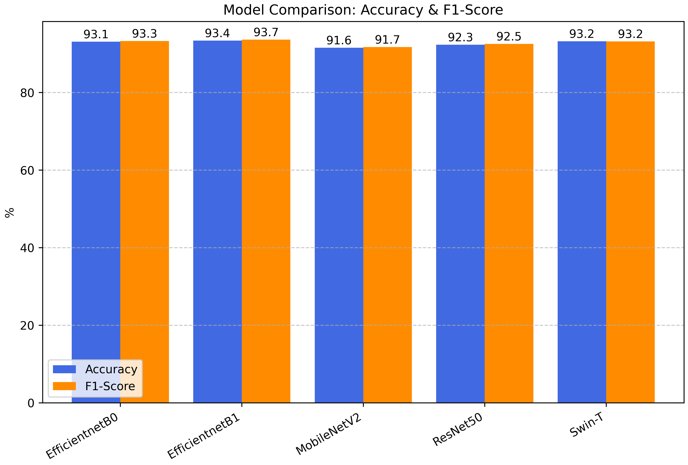

# Deep Learning - Weather Classification
This project was created as the final project for the university course **Deep Learning** at the Hasso Plattner Institute.\
The goal of this project is to classify weather conditions just given image data using the Weather Phenomenon Database (WEAPD).

## Data
The data used in this project is the [Weather Phenomenon Database (WEAPD)](https://www.kaggle.com/datasets/jehanbhathena/weather-dataset/data) which is a dataset of weather images.\
The dataset contains 11 classes of weather conditions:\
Dew, Fogsmog, Frost, Glaze, Hail, Lightning, Rain, Rainbow, Rime, Sandstorm, Snow\
The dataset has the following class distribution:


## Model
### Architecture
We used five different model architectures to classify the weather conditions:
1. ResNet50
2. EfficientNetB0
3. EfficientNetB1
4. MobileNetV2
5. Swin-T

### Weights
Our trained weights are available [here](https://nextcloud.hpi.de/s/wyayfgaR7yJc8B4) with the password: `XY5oAQPncq`.

## Results



## Usage
### Download the data
To download the dataset run:
```bash
python load_dataset.py
```
You can also set the `--path` argument to specify the directory where the data should be downloaded to. We strongly recommend using the default path `./data/weather-dataset` to ensure full compatibility with the code.

### Run training
1. Create a config file in the `cfgs` directory. You can use the `config.yaml` as a template.
2. Run train.py with the config path as an argument.
```bash
python train.py --config_path cfgs/your_config.yaml
```

### Run a sweep
1. Change the sweep parameter in `sweep.py` to the parameters you want to sweep.
2. Run sweep.py
```bash
python sweep.py
```

## Notebooks
We provide three notebooks to further evaluate the data and models:
1. `demo.ipynb` - This notebook presents the data aswell as the model performance.
2. `model_ensemble.ipynb` - This notebook allows ensemble predictions by averaging the predictions of multiple models.
3. `transform_ensemble.ipynb` - This notebook allows ensemble predictions by using different transformations for the same images and averaging the prediction results.
